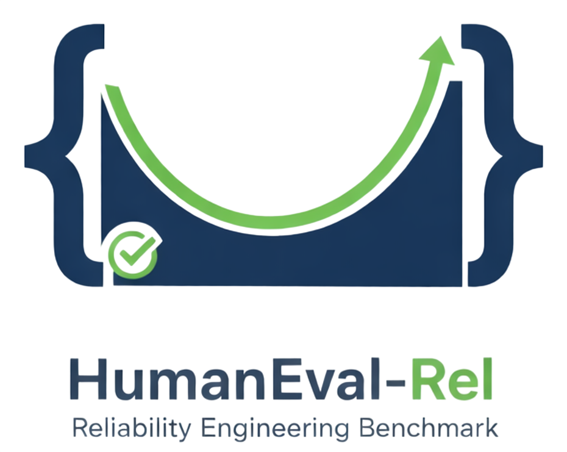

<div align="center">



<!-- # HumanEval-Rel -->

**A HumanEval-style benchmark for evaluating LLM code generation on reliability engineering tasks**

[](https://www.python.org/)
[](LICENSE)

</div>

---

## Overview

HumanEval-Rel is a comprehensive benchmark designed to evaluate Large Language Model (LLM) code generation capabilities specifically for **reliability engineering** tasks. It consists of **40 carefully curated programming problems** across four fundamental categories of reliability engineering.

| Category | Questions | Focus |
|----------|-----------|-------|
| Reliability Metrics & Evaluation | 14 | Failure rates, hazard rates, reliability functions |
| Reliability Modeling | 9 | Series, parallel, k-out-of-n systems |
| Estimation & Data Analysis | 6 | MLE, Kaplan-Meier, regression analysis |
| Maintenance of Repairable Systems | 11 | Availability, renewal theory, replacement policies |

Built on the [Inspect AI](https://inspect.aisi.org.uk/) framework, HumanEval-Rel provides a standardized, reproducible way to assess how well LLMs can solve reliability engineering problems through code generation.

---

## Features

- **40 Handcrafted Problems** - Each with comprehensive test cases and reference solutions
- **Built on Inspect AI** - Leverages industry-standard evaluation framework
- **Comprehensive Analysis Tools** - Generate pass@k curves, heatmaps, error breakdowns
- **Safe Code Execution** - Sandboxed testing environment with timeout protection

---

## Quick Start

### Installation

```bash
git clone https://github.com/sonic160/HumanEval-Rel.git
cd HumanEval-Rel
uv sync
```

### Setup

Create a `.env` file with your API keys:

```bash
OPENROUTER_API_KEY=sk-or-v1-xxxxxxxxxxxxx
```

### Run a Benchmark

```bash
uv run inspect eval ./he_rel/_registry.py@humanevalrel \
    --model openrouter/openai/gpt-4.1-mini:nitro \
    --max-tokens 10000 \
    --epochs 50
```

Refer to the [Inspect AI Documentation](https://inspect.aisi.org.uk/) to change model, model provider and other parameters, the experiments from our paper are precisely defined in  `scripts/run_benchmark.sh`

### Analyze Results

Put the desired `.log` files in a ``/results`` folder where filenames respect the following 

```bash
uv run -m he_rel.analysis.run_analysis
```

---

## Benchmark Structure

Each problem follows the HumanEval format:

```json
{
    "prompt": "def failure_rate(...):",
    "task_id": "0_reliability_metrics_and_evaluation[Q0]",
    "entry_point": "failure_rate",
    "tests": "def check(candidate): ...",
    "metadata": {"origin": "category_name"}
}
```

### Categories

| Index | Category |
|-------|----------|
| 0 | Reliability Metrics & Evaluation |
| 1 | Reliability Modeling |
| 2 | Maintenance of Repairable Systems |
| 3 | Estimation & Data Analysis |

---

## Analysis & Visualization

HumanEval-Rel includes powerful analysis tools:

- **Pass@k Curves** - Model performance across different k values
- **Category Heatmaps** - Performance breakdown by category
- **Error Analysis** - Detailed error type classification
- **Efficiency Metrics** - Tokens per correct answer

Generated artifacts:
- `dashboard.html` - Interactive exploration
- `assets/dashboard/*.png` - Publication-ready figures
- `assets/dashboard/*.pdf` - LaTeX-compatible exports
- `assets/dashboard/*.csv` - Raw data exports

---

<!-- ## Error Types

The benchmark classifies errors into:

| Type | Description |
|------|-------------|
| **Pass** | Correct solution |
| **AssertionError** | Wrong output logic |
| **No Output** | Function not defined |
| **NameError** | Missing imports |
| **TypeError** | Type mismatch |
| **Timeout** | Execution exceeded 5s |
| **ValueError** | Invalid values |
| **SyntaxError** | Invalid Python |

--- -->


## License

Code: MIT License, Benchmark content: CC-BY-4.0- see [LICENSE](LICENSE) for details

---

<div align="center">

**HumanEval-Rel** - Evaluating LLM Code Generation for Reliability Engineering

[Repository](https://github.com/sonic160/HumanEval-Rel) • [Issues](https://github.com/sonic160/HumanEval-Rel/issues)

</div>
