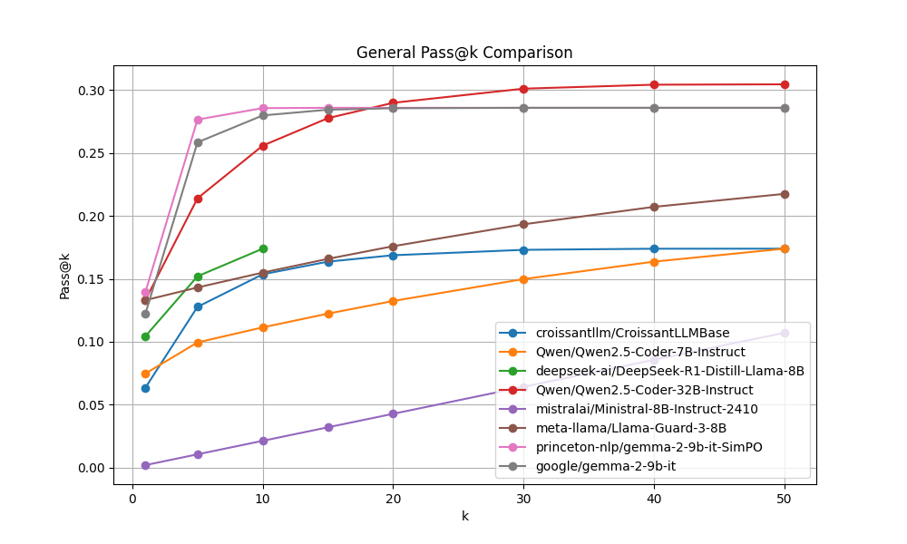
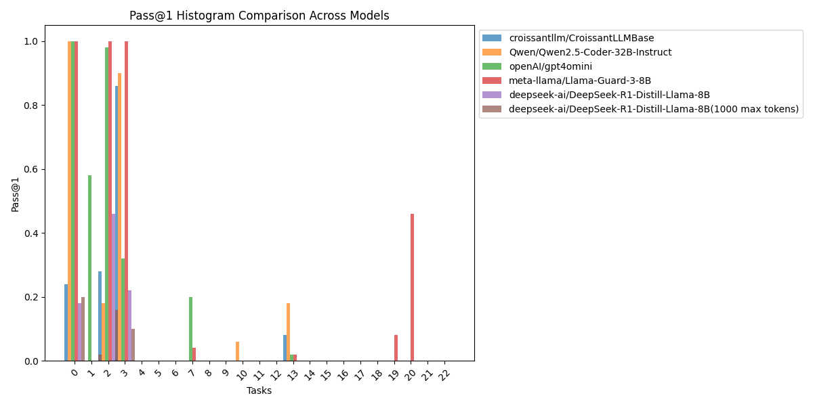
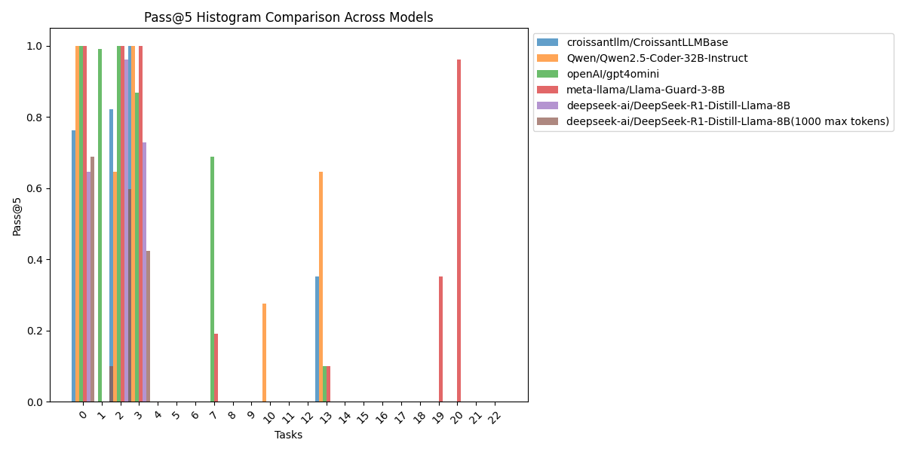
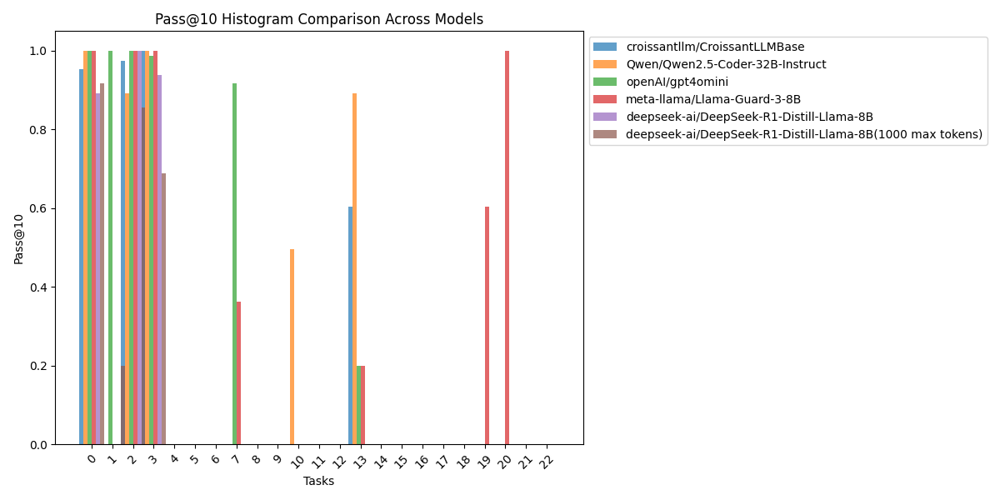
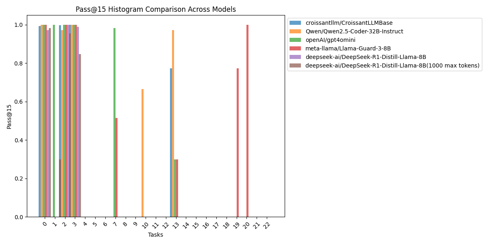
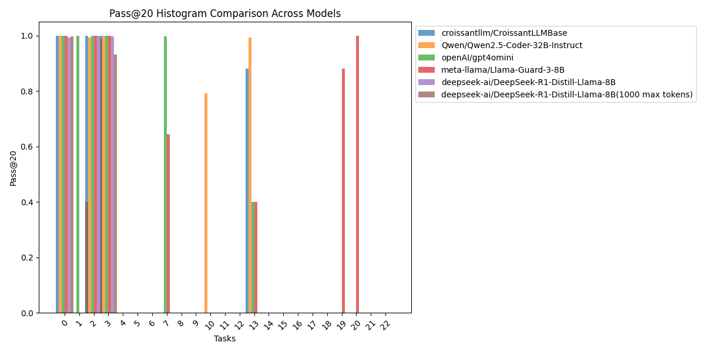

# Pass@k Comparison Report

## Overview
This report compares the Pass@k metrics across different tasks for the provided models.
---
## General Pass@k Graphs
Below is the general Pass@k graph comparing the models.

---
## Pass@k Histograms
### Pass@1 Histogram

---
### Pass@5 Histogram

---
### Pass@10 Histogram

---
### Pass@15 Histogram

---
### Pass@20 Histogram

---
### Pass@30 Histogram

---